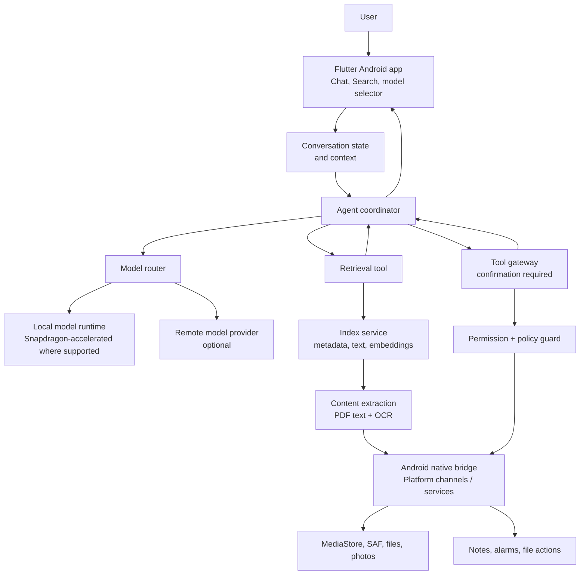
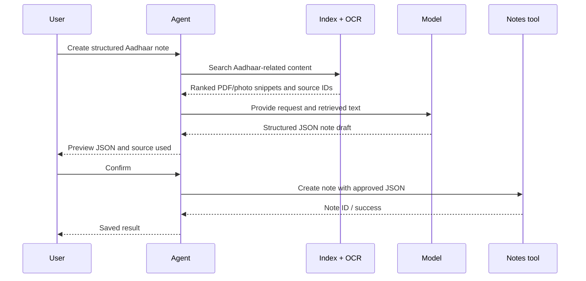

# Android architecture and scope

## Product target

Build an Android-only agent that can hold a conversation, retrieve information from the user’s indexed device content, and carry out approved Android actions. The first end-to-end target is:

> “Create a note in structured JSON with all details on my Aadhaar card.”

The card may be an old PDF or photo with an unrelated filename. The agent must retrieve it from content, use extracted text, produce structured data, ask for confirmation, then save the note.

## Architecture



## Key boundary

The Flutter app is the product shell. Device indexing, OCR access, and OS actions must run through Android-native code exposed to Flutter through platform channels or a native plugin. The current Flask service is a development companion and model/API integration surface; it cannot be the final mechanism for reading a user’s phone files or creating Android alarms.

## Development API transport

Use one configured base URL, never hard-coded addresses in feature code.

| Environment | API route |
| --- | --- |
| Android device over USB | `adb reverse`; Flutter calls `http://127.0.0.1:5000` |
| Android emulator | Flutter calls `http://10.0.2.2:5000` |
| Device on the same Wi-Fi network | Flask binds to `0.0.0.0`; Flutter calls the developer machine’s LAN IP |
| Production | HTTPS endpoint or fully on-device implementation |

Flutter should receive the URL with `--dart-define=API_BASE_URL=...`. For Flutter Web development, Flask must enable CORS. A physical Android phone on Wi-Fi must be on the same trusted network; never expose a development Flask server to the public internet.

## Core contracts

Keep these boundaries stable while implementations evolve.

```text
ModelProvider.complete(messages, tools) -> model response / requested tool call
SearchIndex.search(query, filters) -> ranked document results with snippets and source IDs
OcrExtractor.extract(source) -> text, confidence, page/region metadata
AndroidTool.execute(input) -> proposed action or completed result
PermissionGuard.confirm(action) -> approved / denied
```

Every search result must preserve provenance: source URI, display name, type, timestamp, and text/page location. Every mutating tool call must have a typed input and an explicit confirmation step.

## Delivery sequence

1. **Conversation foundation:** Chat UI, model selection, per-conversation context, and a stable model-provider interface.
2. **Retrieval foundation:** File metadata index, text search, ranked results, and document cards in the UI.
3. **Content extraction:** PDF text extraction and local OCR for photos/scanned PDFs, stored with provenance.
4. **Agent retrieval:** Let the model request search, consume result snippets, and cite the retrieved source in its answer.
5. **Safe actions:** Add notes first, then alarms and controlled file create/move/delete. Each action is previewed and confirmed.

## Aadhaar-to-note flow



## Non-negotiables

- Android only for this scope; do not build iOS or desktop agent capabilities.
- Request the least Android permission needed, at the moment it is needed.
- Do not send files, extracted personal text, or indexes to a remote model without a clear user choice.
- Use local OCR and local inference whenever practical, but provide a measured fallback when a device capability is unavailable.
- Never perform delete, move, send, save, or alarm creation without preview and confirmation.
