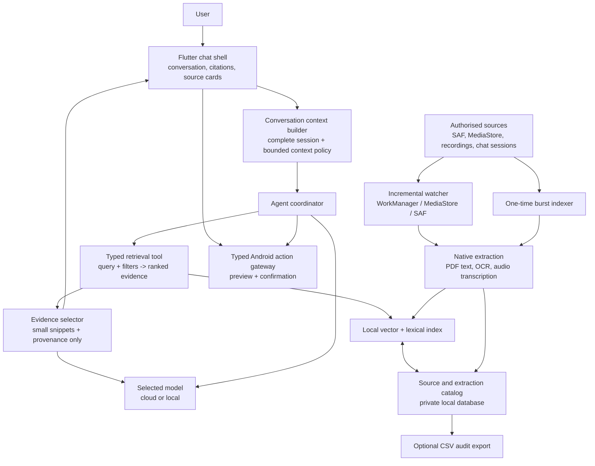
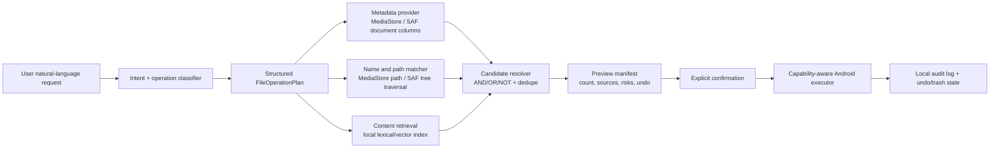

# Android grounded-memory architecture

## Product contract

teamChai is an Android-only assistant that answers from the user's authorised
device content and conversation history. It can use a cloud or local language
model, but neither model receives an original document, image, recording, or
the complete local index. It receives only the selected text evidence and its
provenance. A response that uses device content must cite its source and allow
the user to open that source.

The first complete scenario is: a user asks for Aadhaar details from an old,
poorly named PDF or photo; the app retrieves extracted text, asks a model to
produce a structured note draft, shows the evidence and draft, and creates the
note only after confirmation.

## Target architecture



### Retrieval answer flow

```mermaid
sequenceDiagram
  participant U as User
  participant C as Coordinator
  participant R as Retrieval tool
  participant I as Local index/catalog
  participant M as Selected model
  participant UI as Flutter UI

  U->>C: "Find my Aadhaar details"
  C->>R: typed query + filters
  R->>I: hybrid lexical/vector search
  I-->>R: ranked extraction records + source provenance
  R-->>C: selected evidence only
  C->>M: whole chat context + selected snippets/provenance
  M-->>C: grounded answer / structured draft with source IDs
  C-->>UI: answer, citations, source cards, open URIs
  UI-->>U: inspect source; confirm any mutation separately
```

## Local data model

The production catalog is a private Android database. CSV is an optional,
user-visible export/audit format, not the source of truth or the vector store.

| Record | Required fields | Purpose |
| --- | --- | --- |
| `SourceRecord` | `source_id`, authorised `source_uri`, display name, MIME type, created/modified timestamps, content version, availability | Identifies the original PDF, image, recording, or chat message. |
| `ExtractionRecord` | `extraction_id`, `source_id`, kind, text, page/segment, confidence, extractor version, extracted timestamp | Stores native text, OCR text, transcript, or indexed chat text. |
| `VectorRecord` | `extraction_id`, embedding model/version, vector, indexed timestamp | Makes the extraction semantically searchable. |
| `Evidence` | source/extraction IDs, snippet, score, source URI, type, page/segment | The only retrieval payload sent to a model. |

Extraction kinds are `text`, `pdf_text`, `pdf_ocr`, `image_ocr`,
`audio_transcript`, and `chat_memory`. A single source can have multiple
extractions—for example, a PDF has one record per page, and a recording has
time-coded transcript segments.

An optional CSV export contains: source URI, display name, MIME type, content
version, extraction kind, page/segment, extraction text, confidence, and
timestamps. It must never replace URI permission checks or source availability
checks.

## Context and privacy policy

1. The coordinator reads the complete active chat session from local storage.
2. It applies a documented context-budget policy while retaining a local full
   transcript: recent turns remain verbatim; older turns are compressed or
   selected by relevance with stable message IDs.
3. All sessions are indexed as `chat_memory` records after local persistence.
   The evidence identifies its session, message, role, and timestamp.
4. For a file/content question, retrieval occurs before model completion.
5. The model gets chat context plus a bounded set of selected snippets and
   provenance. It never gets a raw local file merely because it was retrieved.
6. Cloud use is an explicit model choice. The UI must identify the selected
   provider before private text is sent remotely.
7. Every cited source remains openable only while the app holds its authorised
   URI permission; revoked or missing sources are excluded as current evidence.

## Indexing policy

* **Incremental indexing:** Android-compatible scheduled work observes only
  user-authorised SAF trees, MediaStore sources, recordings made by this app,
  and local chat storage. It is not a desktop-style cron job. It detects new or
  changed source versions and queues the shared extraction pipeline.
* **Burst indexing:** a user starts, pauses, resumes, or cancels a one-time
  scan of authorised existing content. It has foreground progress, battery
  constraints, and the same pipeline and deduplication rules as incremental
  indexing.
* **Extraction:** native PDF text comes first; scanned PDF pages and images use
  a measured local OCR engine; recordings use a measured Parakeet-compatible
  local transcription runtime.
* **Indexing:** each successful non-empty extraction is persisted, embedded
  locally, and inserted into hybrid lexical/vector retrieval. Failures are
  stored as explicit source/extraction states, never as fake text.
* **Acceleration:** Snapdragon/NPU/GPU acceleration is optional and must be
  selected only after target-device benchmarking. CPU fallback is mandatory.

## Stable contracts

```text
ConversationContext.build(session, budget) -> messages + retained message IDs
Ingestion.discover(scope) -> authorised SourceRecord changes
Extractor.extract(source unit) -> ExtractionRecord | typed failure
Catalog.upsert(source, extraction) -> current version + stale replacement
SearchIndex.search(RetrievalRequest) -> <= 20 ranked Evidence records
AgentRetrieval.search(request) -> typed Evidence[] | typed failure
ModelProvider.complete(context, evidence) -> grounded response / tool request
AndroidAction.propose(input) -> typed preview
PermissionGuard.confirm(action) -> approved | denied
```

`RetrievalRequest` supports a query, limit (1–20), content-type filters,
MIME-type filters, and optional source URI. Every `Evidence` includes its
source URI/open URI, display name, type, extraction text, contextual snippet,
page/segment when applicable, and ranking score.

## Composable file-operation layer

Natural-language file requests are planned into structured queries; a model never
receives authority to traverse, move, or delete a URI directly. The planner may
compose metadata, filename/path, and content predicates in one query, but the
Android executor is the sole component that resolves and mutates actual sources.



### Query domains

| Natural-language condition | Structured predicate | Android-backed provider |
| --- | --- | --- |
| “created before 2020”, “larger than 500 MB”, “all PDFs” | date, size, MIME/type, media kind | MediaStore columns where visible; SAF document metadata where supplied by the provider |
| “invoice in its name”, “from Downloads”, “under project folder” | name contains/glob, relative path, selected SAF tree | MediaStore `DISPLAY_NAME`/`RELATIVE_PATH`; DocumentsContract tree traversal |
| “contains John”, “related to Aadhaar” | extracted-text lexical/semantic predicate | Existing local extraction/vector index |

Compound requests are an abstract syntax tree, not prompt text. For example,
“delete PDFs containing John created before 2020” is `AND(mime == PDF,
content contains John, effectiveDate < 2020-01-01)`. The candidate resolver
intersects stable source IDs, re-checks source availability/capability, and
deduplicates a source that has multiple extraction/page matches.

### Android constraints and reuse

Use Android's providers rather than raw path traversal. MediaStore exposes
display name, relative path, MIME type, size, added/modified values, and
generation numbers; generation numbers are more reliable for change detection
than date-added alone. `DATE_ADDED` is the time an item entered MediaStore and
`DATE_MODIFIED` is a filesystem-derived modification time; neither is a
universal file-creation timestamp. `DATE_TAKEN` may be useful for captured
media, but is not creation proof. `RELATIVE_PATH` is for organisation and must
not be converted into a raw filesystem path. [MediaStore MediaColumns](https://developer.android.com/reference/android/provider/MediaStore.MediaColumns.html)

For non-media documents, use Storage Access Framework (SAF) document/tree URIs
and `DocumentsContract`. SAF grants access only to user-selected documents or
trees; each provider advertises its own write/delete/move capability. The
executor must reject unsupported operations instead of falling back to raw-file
APIs. [Android SAF guide](https://developer.android.com/training/data-storage/shared/documents-files), [DocumentsContract capabilities](https://developer.android.com/reference/android/provider/DocumentsContract.Document)

### Structured plan and primitives

```text
FileOperationPlan {
  operation: LIST | MOVE | SOFT_DELETE | RESTORE | RENAME
  predicate: And | Or | Not | MetadataPredicate | PathPredicate | ContentPredicate
  scope: authorised MediaStore collection | persisted SAF tree/document
  candidateLimit: positive bounded number
  destination: optional authorised URI/tree
  requestedBy: user turn ID
}

FileQuery.resolve(plan) -> CandidateFile[]
FileAction.preview(operation, candidates) -> PreviewManifest
FileAction.execute(approvedManifest) -> ExecutionReceipt
```

`CandidateFile` contains stable source ID, authorised URI, name, MIME type,
available metadata, matching predicates, provider capabilities, and a current
content/version check. The LLM may suggest a plan, but a deterministic validator
parses/validates its typed form, enforces limits and scope, and generates the
preview manifest.

### Safety model

* `LIST` is read-only but still limited to authorised scope and results.
* `MOVE`, `RENAME`, `SOFT_DELETE`, and `RESTORE` always require a preview and
  explicit confirmation tied to an immutable candidate manifest.
* Destructive requests use provider-supported trash/recoverable deletion where
  available. Permanent deletion is not in the first release. If a provider has
  no reversible capability, the executor reports unsupported rather than making
  deletion irreversible.
* Before execution, re-resolve every URI and content version; changed, missing,
  revoked, or unsupported candidates are excluded and reported.
* Store a local audit record with request, structured plan, manifest hash,
  confirmation, per-source result, timestamps, and undo/trash reference. Do not
  log raw extracted content unnecessarily.
* Bulk actions have a bounded candidate limit and require a second explicit
  confirmation when the actual count differs from the preview.

## Acceptance contracts

| Capability | Acceptance contract |
| --- | --- |
| Grounded document answer | A poorly named authorised PDF/photo is found by extracted Aadhaar-style text; the response visibly cites it and opens the same source URI. |
| No invented retrieval | With zero results, revoked permission, or an index failure, the UI says so and does not fabricate file, OCR, action, or transcript details. |
| Conversation context | A later turn can use a fact from an earlier turn in the same session; a cross-session fact is returned only as provenance-bearing `chat_memory` evidence. |
| Audio memory | A recorded meeting has a local recording URI and time-coded non-empty transcript; a later query retrieves and cites the relevant segment. |
| Incremental ingestion | A newly added authorised image/PDF is extracted and searchable without an upload control or manual re-entry. |
| Burst ingestion | Existing authorised sources can be indexed once with durable progress, cancellation, resume, deduplication, and no network transfer. |
| Stale replacement | Re-indexing a changed URI/page removes old text from both lexical and vector results. |
| Model privacy | A cloud request contains only conversation text allowed by the user plus selected evidence snippets/provenance, never the original retrieved file. |
| Safe actions | A structured note draft exposes its cited evidence and is saved only after an explicit preview and confirmation. |
| File-operation planning | Metadata, filename/path, content, and compound natural-language requests produce a validated `FileOperationPlan` and a candidate set with matching reasons; no raw filesystem command is model-generated. |
| File-operation safety | A move/rename/soft-delete previews exact candidates, rechecks each URI/version at execution, records an audit receipt, and never permanently deletes in the first release. |
| Performance | The chosen embedding/transcription runtime reports target-device latency, recall/accuracy, package size, memory/battery impact, acceleration path, and CPU fallback. |

## Current implementation truth — 2026-08-29

| Area | State |
| --- | --- |
| Flutter chat shell, sessions, model selector | Present. Sessions are stored locally as Markdown with YAML-like frontmatter. |
| Cloud OpenRouter response path | Present when a valid user-configured key is available. |
| Model discovery/downloader UI | Present. A downloaded local model is not yet connected to real local chat inference. |
| Local Android index | Present behind a Flutter method channel; it stores explicit text/OCR records with provenance, stale replacement, snippets, filters, and a semantic-embedding implementation. Device compilation/benchmark evidence is still required. |
| Typed retrieval-to-agent boundary | Present. File-like prompts retrieve before cloud completion and pass selected evidence/provenance; failure/no-result states are explicit. |
| Chat context to LLM | Partial. The current path sends only the most recent six messages; complete-session budgeting and chat-memory indexing are not implemented. |
| Chat-memory index | Not implemented. Markdown persistence is not search indexing. |
| OCR/scanner/PDF extraction | Not implemented. The current index only accepts records supplied by another component. |
| Background watcher and burst index | Not implemented. |
| Parakeet audio transcription | UI/service scaffold only; it currently simulates voice status/sample text and does not record or transcribe audio. |
| Upload control | Srividya's branch removes the visible add/upload affordance, but stale attachment simulation code must be removed as part of the UI cleanup acceptance test. |
| Actions (notes, files, messages, alarms) | Not implemented as real Android actions; only UI/action placeholders exist. |
| File-operation planner/executor | Not implemented. Current scope has no metadata/path query planner, SAF/MediaStore capability executor, trash/undo, or audit manifest. |

## Non-negotiables

* Android-only scope; no broad filesystem access or invented `content://` URIs.
* Local indexing/extraction by default; no source content leaves the device
  without explicit user choice.
* No simulated success may look like OCR, retrieval, transcription, inference,
  or an Android action.
* Keep UI, ingestion, catalog/index, retrieval/agent, and action gateway
  replaceable. Do not bypass their contracts.
* Never move, delete, send, save, or create an alarm without typed preview and
  explicit confirmation.
