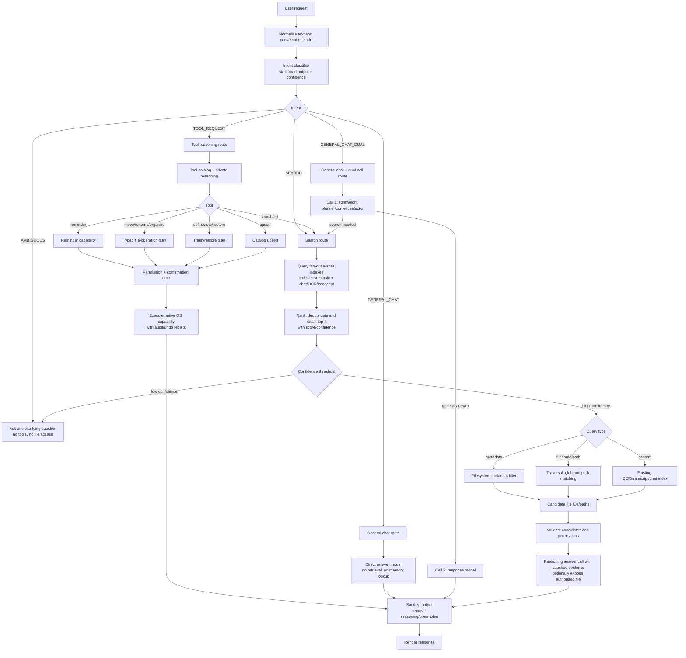

# Intent-routing EAT

Here EAT means the execution/agent tree: the first layer decides what kind of
work the request represents, and only the selected child is allowed to invoke
its tools. This is a routing contract, not a prompt suggestion.



## Routing contract

The classifier returns only:

```json
{
  "intent": "GENERAL_CHAT | GENERAL_CHAT_DUAL | SEARCH | AMBIGUOUS",
  "confidence": 0.0,
  "query": "normalised user request"
}
```

`GENERAL_CHAT` must not call the retrieval tool, synchronize chat memory, or
construct file evidence. `SEARCH` must retrieve before making file claims.
`GENERAL_CHAT_DUAL` is allowed to make two model calls, but the first call is a
small planner and the second is the answer call; neither call may access files
unless the planner explicitly upgrades the request to `SEARCH`. Low-confidence
classification goes to `AMBIGUOUS`, never to a guessed tool invocation.

## Temperature policy

Temperature controls token sampling randomness; it is not a routing confidence
score. There is no single “correct current temperature” for this field:

| Stage | Recommended temperature | Reason |
|---|---:|---|
| Intent classification | `0.0` (or greedy decoding) | Stable labels and repeatable routing |
| Search/query rewriting | `0.0–0.1` | Preserve names, dates, paths and operators |
| Normal local chat | `0.2–0.4` | Natural language without unnecessary drift |
| Creative writing only | `0.6–0.8` | Diversity is useful here, not for routing |

The current LiteRT-LM bridge should explicitly configure these values instead of
inheriting a model default. In particular, the classifier and search planner
must not use a reasoning/thinking mode. For Qwen-style templates,
`enable_thinking=false` is a required optimization, but output sanitization is
still a final safety boundary.

Hugging Face describes temperature as changing how unpredictable the next token
is selected, while deterministic generation uses greedy decoding; Microsoft’s
agent guidance likewise recommends temperature `0` for planning and routing
tasks. See [Transformers generation options](https://github.com/huggingface/transformers/blob/main/docs/source/en/llm_tutorial.md)
and [Microsoft agent model guidance](https://learn.microsoft.com/en-us/azure/microsoft-discovery/how-to-select-models-for-agents).

## Acceptance checks

1. “Hello” produces `GENERAL_CHAT` and creates zero retrieval/index calls.
2. “Find my invoice from 2024” produces `SEARCH` and uses the appropriate
   metadata/path/content branch.
3. A compound file request combines predicates before returning candidates.
4. Ambiguous requests ask for clarification rather than searching by default.
5. No visible response contains `<think>`, `<analysis>`, planner traces, or
   internal tool reasoning.
6. Every destructive file action remains behind candidate validation and the
   existing confirmation/rollback contract.
