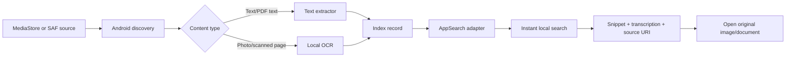

# Local indexing research and implementation plan

## Decision

Use **Android AppSearch LocalStorage** as the production local lexical index. It is an on-device search library for structured data and full-text search; LocalStorage keeps an app-specific index in app data, supports Android 5.0+, and avoids system-service binder latency. It is the best fit for a private, instant, app-owned index. [Android AppSearch overview](https://developer.android.com/develop/ui/views/search/appsearch) [Jetpack AppSearch release information](https://developer.android.com/jetpack/androidx/releases/appsearch)

Use the reference `LocalTextIndex` in this repository to lock down the ingestion/search contract now. It is deliberately in-memory and Flask-hosted for development; the Android implementation must replace it with an AppSearch adapter behind the same contract.

## What can run locally on Android

| Capability | Local approach | Decision |
| --- | --- | --- |
| File and image discovery | MediaStore for media; SAF for user-chosen documents/directories | Use both; preserve granted `content://` URIs. |
| Text indexing | AppSearch LocalStorage | Build first. |
| Document text | Extract directly when a selected document format supports it | Index extracted text per source/page. |
| Image OCR | ML Kit Text Recognition, bundled for offline readiness | OCR output feeds the same index. |
| Local semantic retrieval | Small embedding model plus a vector store | Later spike; lexical AppSearch is the first release. |
| Model acceleration | Snapdragon-compatible runtime where benchmarked | Suprith owns the measurement and fallback. |

Android’s Storage Access Framework gives the user a picker and persistent URI access to selected documents/directories; it is the correct privacy-preserving path for non-media documents. MediaStore is the platform route for shared images, while scoped storage limits broad filesystem access. [SAF documentation](https://developer.android.com/training/data-storage/shared/documents-files) [Android storage overview](https://developer.android.com/training/data-storage/)

ML Kit Text Recognition runs on-device on Android API 21+ and supports bundled or dynamically delivered models. Use its bundled option for the first offline OCR milestone; record script coverage, quality, latency, and package-size trade-offs before choosing alternatives. [ML Kit Text Recognition](https://developers.google.com/ml-kit/vision/text-recognition/v2/android)

## Index record contract

One source can create one or more index records: one record for a text file, one per PDF page where useful, and one per photo/OCR result.

```text
id                stable source + content-version identifier
source_uri        persisted content:// URI; used to open the original file/image
display_name      human-readable title
mime_type         source MIME type
content_type      text | pdf_text | pdf_ocr | image_ocr
transcription     extracted text or OCR transcription
page              optional source page
ocr_confidence    optional OCR score
modified_at       source freshness marker (Android adapter)
```

The search response returns `transcription`, a contextual `snippet`, and both `source_uri` and `open_uri`. That is what lets the UI show OCR text and open the exact original image rather than a detached string.

## Ingestion architecture



## Current reference API

```text
POST /index/text    index extracted text or native PDF text
POST /index/ocr     index OCR output for an image/scanned page
GET  /search?q=...  return ranked results with transcription and open_uri
```

## Android integration boundary

The Android adapter owns the AppSearch index. It accepts extracted text or OCR output as the same record, searches locally, and returns the matched transcription with the original content URI.

The Flutter-facing side is deliberately non-UI. It can index text, index OCR output, and search, but does not discover files, run OCR, or choose how results look. This keeps discovery/OCR workers separate from Vidya’s search surface.


```json
{
  "id": "image-42-v1",
  "source_uri": "content://media/external/images/media/42",
  "display_name": "IMG_20240103.jpg",
  "mime_type": "image/jpeg",
  "transcription": "Government of India Aadhaar Ravi Kumar ...",
  "ocr_confidence": 0.96
}
```

## Stage-one acceptance checks

The reference implementation is accepted only when all of these pass without a frontend:

1. Text can be indexed and found by a partial query.
2. OCR text from a poorly named image can be found by its content.
3. The result returns the full OCR transcription and an `open_uri` for the original image.
4. Re-indexing the same source removes stale terms.
5. Invalid records are rejected rather than silently indexed.

## Integration milestones

1. Keep the Flask reference API green with unit tests while the Flutter shell uses mocked results.
2. Add an Android plugin exposing `upsert`, `search`, and `openUri` through a narrow platform-channel contract.
3. Implement AppSearch schema/indexing and SAF/MediaStore source tracking.
4. Let Suprith’s OCR adapter emit the record contract directly; do not create a second OCR-only store.
5. Update Flutter search results to render snippets, OCR transcription, source type, and an Open action.
6. Add incremental re-indexing with source URI, last-modified value, and content version; delete stale records when permission is revoked or a source disappears.

## Open decisions

- PDF native-text extraction library and fallback to page-render + OCR.
- Exact Android minimum SDK and target devices.
- Embedding model/vector index after lexical quality is measured.
- Retention and encryption policy for extracted sensitive text.
